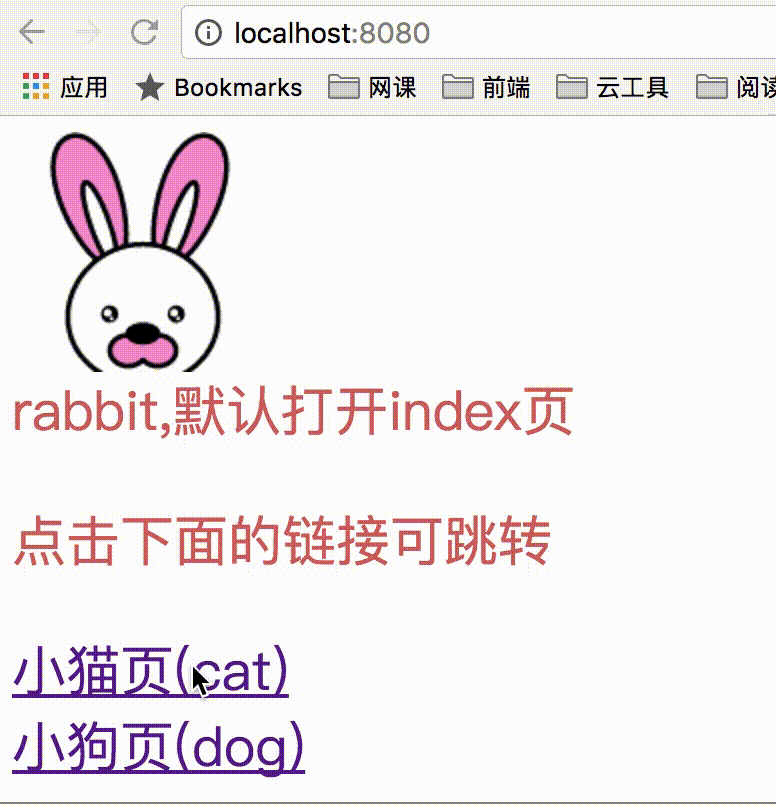

## 使用说明

这是一个使用`webpack`配置多页应用的简易`demo`。

多页面依据`/src`中的目录动态生成。

如本例中`/src`文件夹下有`/cat`,`/dog`,`/index`三个页面，打包后将自动生成`cat.html`,`dog.html`,`index.html`。三个文件都具有自己独立的依赖，都可独立使用。

### 使用方法

1. 下载本目录；
2. 执行`npm i`,也可以使用`cnpm i`,`yarn add`安装依赖；
3. 执行`npm start`可打开本地服务器查看效果,默认为`localhost:8080`;
4. 执行`npm run build:dev`可打包生成开发环境文件；
5. 执行`npm run build:pros`可打包生成生产环境文件；

**演示示例**

部分配置参考了[banmunongtian/react-es6-webpack](https://github.com/banmunongtian/react-es6-webpack/blob/master/webpack.config.js)

